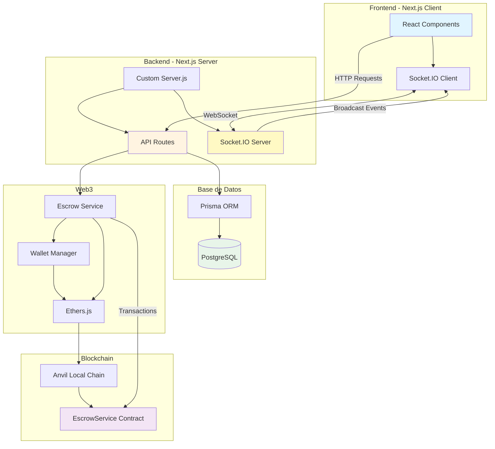
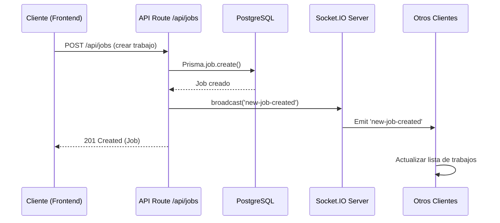
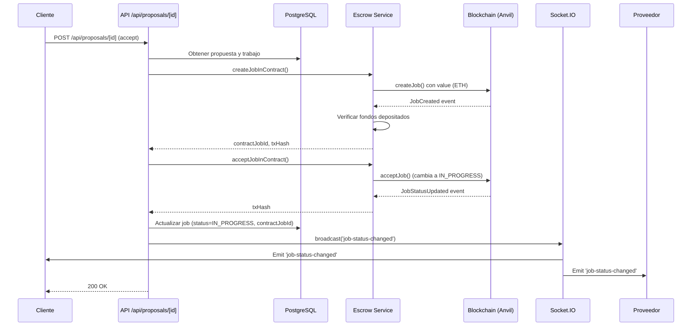
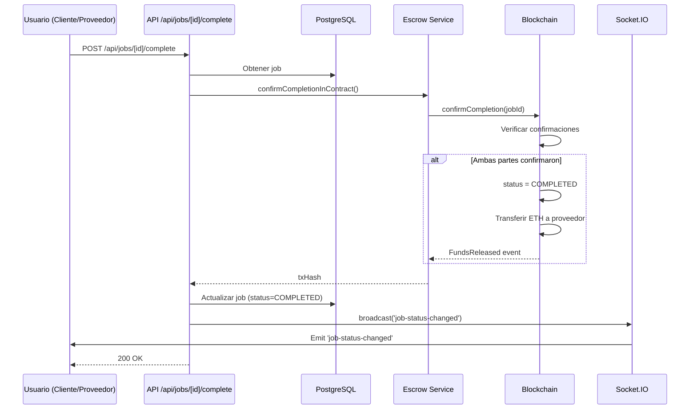
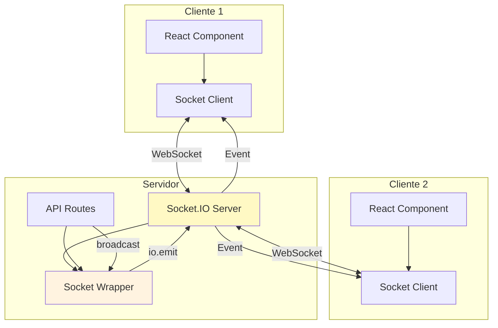
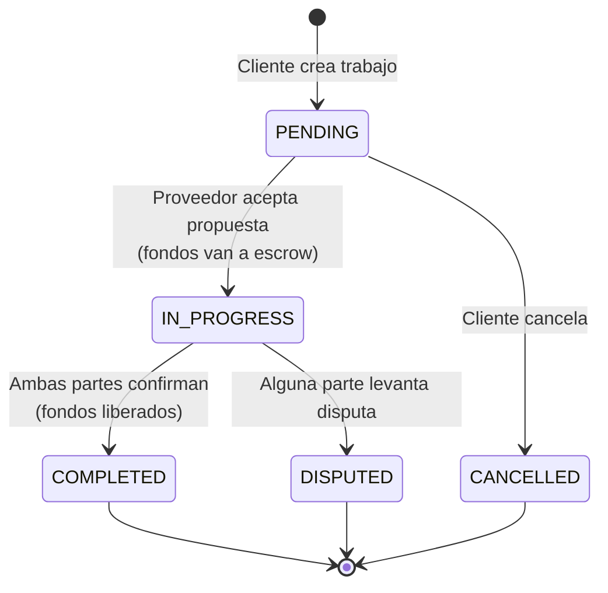
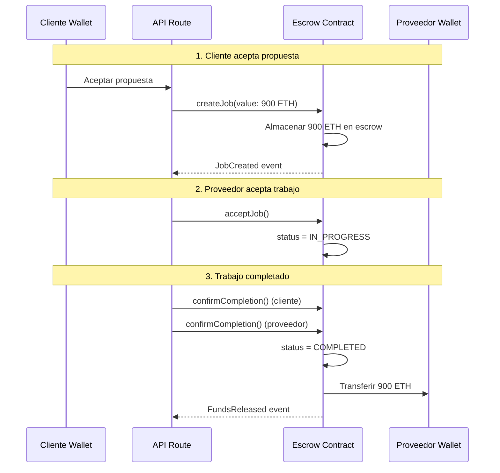
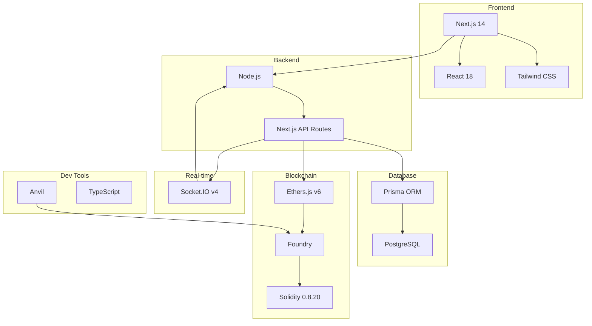

# Arquitectura del Sistema - Service Platform

## Diagrama General del Sistema



## Flujo de Creación de Trabajo



## Flujo de Aceptación de Propuesta



## Flujo de Completar Trabajo



## Arquitectura de Componentes Detallada

```mermaid
graph LR
    subgraph "Frontend Layer"
        A[app/jobs/page.tsx<br/>Lista de trabajos]
        B[components/CreateJobModal]
        C[components/ProposalModal]
        D[components/NotificationToast]
        E[hooks/useNotifications]
        F[lib/socket-client.ts]
    end
    
    subgraph "API Layer"
        G[app/api/jobs/route.ts<br/>GET/POST jobs]
        H[app/api/proposals/route.ts<br/>POST proposals]
        I[app/api/proposals/[id]/route.ts<br/>Accept/Reject]
        J[app/api/jobs/[id]/complete/route.ts]
        K[app/api/jobs/[id]/route.ts<br/>DELETE job]
    end
    
    subgraph "Business Logic"
        L[lib/web3/escrow.ts<br/>Contract interactions]
        M[lib/web3/wallet.ts<br/>Wallet management]
        N[lib/web3/utils.ts<br/>Provider & ABI]
    end
    
    subgraph "Real-time Communication"
        O[server/socket.js<br/>Socket.IO Server]
        P[server/socket-wrapper.ts<br/>TypeScript wrapper]
        Q[server.js<br/>Custom Next.js server]
    end
    
    subgraph "Data Layer"
        R[lib/prisma.ts<br/>Prisma Client]
        S[(PostgreSQL<br/>Database)]
    end
    
    subgraph "Blockchain Layer"
        T[Anvil<br/>Local Blockchain]
        U[EscrowService.sol<br/>Smart Contract]
    end
    
    A --> G
    A --> I
    A --> J
    B --> G
    C --> H
    D --> E
    E --> F
    F <--> O
    
    G --> R
    G --> P
    H --> R
    I --> R
    I --> L
    J --> R
    J --> L
    K --> R
    K --> P
    
    L --> M
    L --> N
    M --> N
    N --> T
    
    P --> O
    Q --> O
    Q --> G
    
    R --> S
    L --> U
    U --> T
    
    style A fill:#e3f2fd
    style G fill:#fff3e0
    style L fill:#f3e5f5
    style O fill:#fff9c4
    style R fill:#e8f5e9
    style U fill:#fce4ec
```

## Flujo de Datos - Socket.IO



## Estados del Trabajo



## Flujo de Fondos (Escrow)



## Stack Tecnológico



## Componentes Principales y Responsabilidades

### Frontend
- **app/jobs/page.tsx**: Página principal que muestra trabajos y maneja interacciones
- **components/CreateJobModal**: Modal para crear nuevos trabajos
- **components/ProposalModal**: Modal para enviar propuestas
- **components/NotificationToast**: Muestra notificaciones en tiempo real
- **hooks/useNotifications**: Hook para manejar notificaciones
- **lib/socket-client.ts**: Cliente Socket.IO singleton

### Backend API
- **app/api/jobs/route.ts**: CRUD de trabajos
- **app/api/proposals/route.ts**: Crear propuestas
- **app/api/proposals/[id]/route.ts**: Aceptar/rechazar propuestas
- **app/api/jobs/[id]/complete/route.ts**: Completar trabajos
- **app/api/jobs/[id]/route.ts**: Eliminar trabajos

### Web3 Layer
- **lib/web3/escrow.ts**: Interacciones con el contrato EscrowService
- **lib/web3/wallet.ts**: Gestión de billeteras y encriptación
- **lib/web3/utils.ts**: Provider y ABI del contrato

### Real-time
- **server/socket.js**: Servidor Socket.IO
- **server/socket-wrapper.ts**: Wrapper TypeScript para API routes
- **server.js**: Servidor Next.js personalizado

### Data
- **lib/prisma.ts**: Cliente Prisma
- **prisma/schema.prisma**: Schema de la base de datos

### Smart Contract
- **contracts/EscrowService.sol**: Contrato principal de escrow

